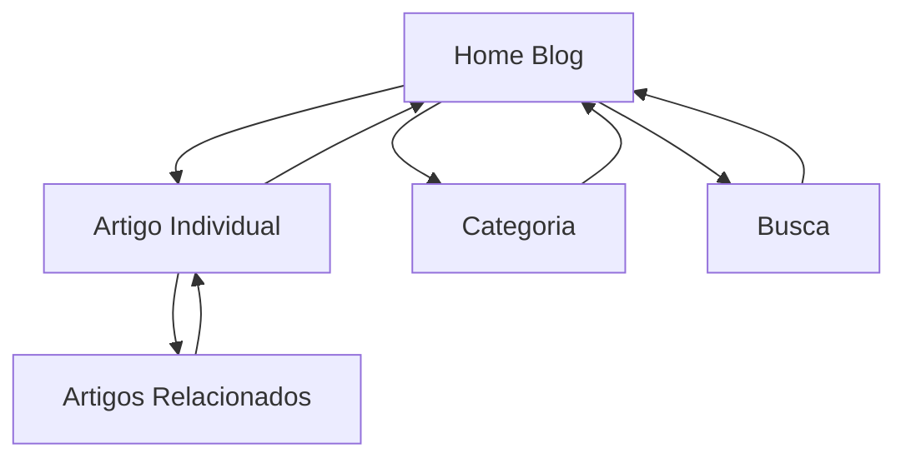

## 1. Product Overview
Blog corporativo da Growmate para publicação de conteúdo sobre agentes de IA e transformação digital. 
- Objetivo: Atrair tráfego orgânico através de conteúdo SEO otimizado e estabelecer a Growmate como autoridade em agentes de IA no Brasil.
- Público-alvo: Empresários, gestores e profissionais interessados em implementação de IA no negócio.

## 2. Core Features

### 2.1 User Roles
| Role | Registration Method | Core Permissions |
|------|---------------------|------------------|
| Leitor | Não requer registro | Ler artigos, navegar por categorias |
| Editor | Convite interno | Criar, editar e publicar artigos |
| Administrador | Convite interno | Gerenciar usuários, configurações do blog |

### 2.2 Feature Module
O blog da Growmate consiste nas seguintes páginas principais:
1. **Página inicial do blog**: Lista de artigos em destaque, navegação por categorias, busca simples.
2. **Página do artigo**: Conteúdo completo do artigo, artigos relacionados, navegação entre posts.
3. **Página de categoria**: Lista de artigos filtrados por categoria específica.
4. **Página de busca**: Resultados de busca por palavras-chave.

### 2.3 Page Details
| Page Name | Module Name | Feature description |
|-----------|-------------|---------------------|
| Página inicial do blog | Hero section | Exibir artigo em destaque com imagem grande e título chamativo |
| Página inicial do blog | Lista de artigos | Mostrar cards com imagem, título, subtítulo, autor e data de publicação |
| Página inicial do blog | Categorias | Menu lateral com links para categorias principais (IA, Automação, Cases) |
| Página inicial do blog | Busca simples | Campo de busca para encontrar artigos por palavras-chave |
| Página do artigo | Cabeçalho do artigo | Exibir título, subtítulo, autor, data de leitura estimada e imagem de capa |
| Página do artigo | Conteúdo | Renderizar texto formatado com títulos, parágrafos, listas e negritos |
| Página do artigo | Artigos relacionados | Mostrar 3 artigos relacionados baseados em tags ou categoria |
| Página do artigo | Navegação | Links para próximo e anterior artigo na sequência |
| Página de categoria | Lista filtrada | Exibir apenas artigos da categoria selecionada |
| Página de categoria | Título da categoria | Mostrar nome da categoria e descrição breve |
| Página de busca | Resultados | Listar artigos que contenham o termo buscado no título ou conteúdo |
| Página de busca | Termo buscado | Exibir "Resultados para: [termo]" e quantidade de resultados |

## 3. Core Process
**Fluxo do Leitor**: Usuário acessa blog → Visualiza lista de artigos → Clica em artigo interessante → Lê conteúdo completo → Navega para artigos relacionados ou volta para lista.

**Fluxo de Descoberta**: Usuário encontra artigo via Google → Acessa artigo diretamente → Lê conteúdo → Explora artigos relacionados → Retorna futuramente para novos conteúdos.

## 4. User Interface Design
### 4.1 Design Style
- Cores primárias: Preto (#000000) e branco (#FFFFFF) com detalhes em verde (#00FF88)
- Tipografia: Fonte sans-serif moderna (Inter ou similar), títulos grandes (32-48px), corpo 18px
- Layout: Clean e minimalista inspirado no Medium, foco na legibilidade
- Cards de artigos: Imagens retangulares (16:9), títulos em negrito, subtítulos em cinza
- Espaçamento generoso entre elementos para conforto visual

### 4.2 Page Design Overview
| Page Name | Module Name | UI Elements |
|-----------|-------------|-------------|
| Página inicial do blog | Hero section | Imagem full-width (1200x600), título sobreposto em branco, botão "Ler artigo" |
| Página inicial do blog | Lista de artigos | Grid responsivo (3 colunas desktop, 1 mobile), cards com hover effect sutil |
| Página do artigo | Conteúdo | Largura máxima 740px, linha altura 1.6, parágrafos com margem 24px |
| Página do artigo | Artigos relacionados | Cards horizontais menores (300x150), títulos em 18px |

### 4.3 Responsiveness
Desktop-first com breakpoints para tablet (768px) e mobile (480px). Em mobile, navegação se torna hambúrguer menu e grid de artigos vira lista vertical única.