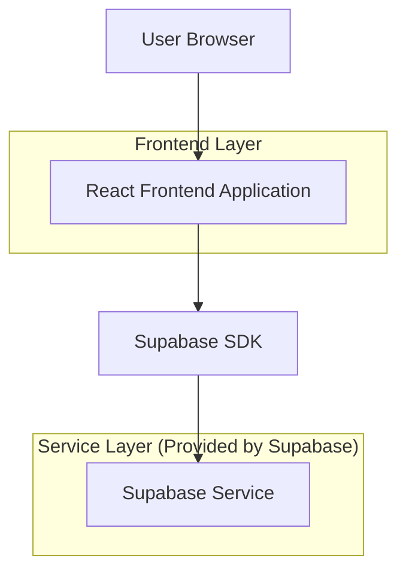
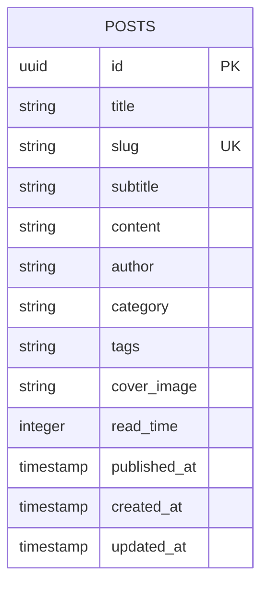

## 1. Architecture design



## 2. Technology Description
- Frontend: React@18 + tailwindcss@3 + vite
- Initialization Tool: vite-init
- Backend: Supabase (Database + Storage + Auth)
- Database: PostgreSQL (via Supabase)

## 3. Route definitions
| Route | Purpose |
|-------|---------|
| /blog | Página inicial do blog, lista todos os artigos |
| /blog/post/:slug | Página individual do artigo, exibe conteúdo completo |
| /blog/categoria/:category | Lista artigos filtrados por categoria |
| /blog/busca | Resultados de busca por termos |

## 4. API definitions
### 4.1 Core API

**Listar artigos**
```
GET /api/posts
```

Request:
| Param Name| Param Type  | isRequired  | Description |
|-----------|-------------|-------------|-------------|
| limit     | number      | false       | Número de artigos a retornar (default: 10) |
| offset    | number      | false       | Paginação (default: 0) |
| category  | string      | false       | Filtrar por categoria |

Response:
| Param Name| Param Type  | Description |
|-----------|-------------|-------------|
| posts     | array       | Array de objetos Post |
| total     | number      | Total de artigos |

**Obter artigo único**
```
GET /api/posts/:slug
```

Response:
| Param Name| Param Type  | Description |
|-----------|-------------|-------------|
| post      | object      | Objeto Post completo |

**Buscar artigos**
```
GET /api/posts/search
```

Request:
| Param Name| Param Type  | isRequired  | Description |
|-----------|-------------|-------------|-------------|
| q         | string      | true        | Termo de busca |

## 5. Server architecture diagram
Não aplicável - Arquitetura serverless utilizando apenas Supabase

## 6. Data model

### 6.1 Data model definition


### 6.2 Data Definition Language
**Tabela de Posts**
```sql
-- create table
CREATE TABLE posts (
    id UUID PRIMARY KEY DEFAULT gen_random_uuid(),
    title VARCHAR(255) NOT NULL,
    slug VARCHAR(255) UNIQUE NOT NULL,
    subtitle VARCHAR(500),
    content TEXT NOT NULL,
    author VARCHAR(100) NOT NULL,
    category VARCHAR(50) NOT NULL,
    tags TEXT[],
    cover_image VARCHAR(500),
    read_time INTEGER DEFAULT 5,
    published_at TIMESTAMP WITH TIME ZONE,
    created_at TIMESTAMP WITH TIME ZONE DEFAULT NOW(),
    updated_at TIMESTAMP WITH TIME ZONE DEFAULT NOW()
);

-- create indexes
CREATE INDEX idx_posts_published_at ON posts(published_at DESC);
CREATE INDEX idx_posts_category ON posts(category);
CREATE INDEX idx_posts_slug ON posts(slug);

-- RLS policies
ALTER TABLE posts ENABLE ROW LEVEL SECURITY;

-- Grant read access to everyone
GRANT SELECT ON posts TO anon;
GRANT SELECT ON posts TO authenticated;

-- Full access for authenticated users (editors)
GRANT ALL PRIVILEGES ON posts TO authenticated;
```

**Dados iniciais de exemplo**
```sql
INSERT INTO posts (title, slug, subtitle, content, author, category, tags, cover_image, read_time, published_at) VALUES
('Por que 2026 vai ser o ano dos agentes de IA no Brasil', '2026-ano-dos-agentes-ia-brasil', 'A verdade nua e crua sobre quem está realmente construindo o futuro', '# Conteúdo completo do artigo em markdown...', 'Growmate Team', 'IA', '{"agentes-ia", "2026", "automação"}', 'https://images.unsplash.com/photo-1677442136019-21780ecad995', 8, NOW());
```